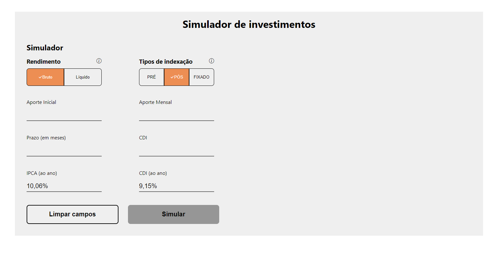

## Sobre

Este desafio tem como objetivo testar os meus conhecimentos relacionados ao front-end reproduzindo uma aplicação capaz de se comunicar com uma API fake. É possível selecionar e preencher campos. Em campos que são esperados números seu tipo de unidade também deverá acompanhar o valor, caso contrário a formatação/máscara é desestruturada e mostrado um aviso de erro. Só é possível fazer uma simulação em caso de todos os campos estarem preenchidos corretamente e não nulos.

## O que foi utilizado

- React como framework SPA.
- React Hooks: useState, useEffect, remask (para mascarar os valores de alguns inputs).
- Axios para comunicação com a API.
- CSS para estilização.
- ESLint e Prittier para formatação de código.

## Instruções de uso

- Primeiramente deverá ser utilizada a API. Para isso, clone o seguinte repositório: https://github.com/eqi-investimentos/desafio-fake-api.
- Instale suas dependências com:
- `npm install` ou caso esteja utilizando o yarn `yarn` para instalar suas dependências.
- Execute o comando `npx json-server db.json`.
- Após isso clone o repositório desta aplicação.
- Excute o comando `npm install` ou `yarn` para instalar as dependências.
- Execute o comando: `npm run dev` ou `yarn dev`.
